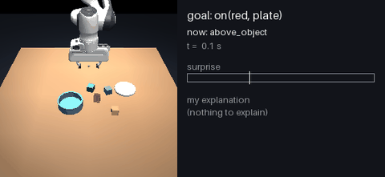
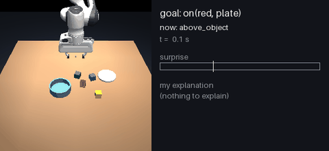
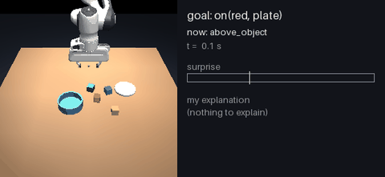
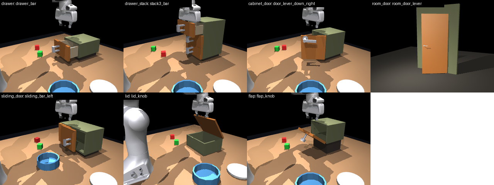
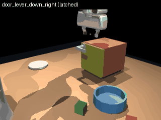
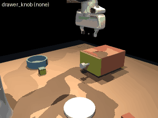
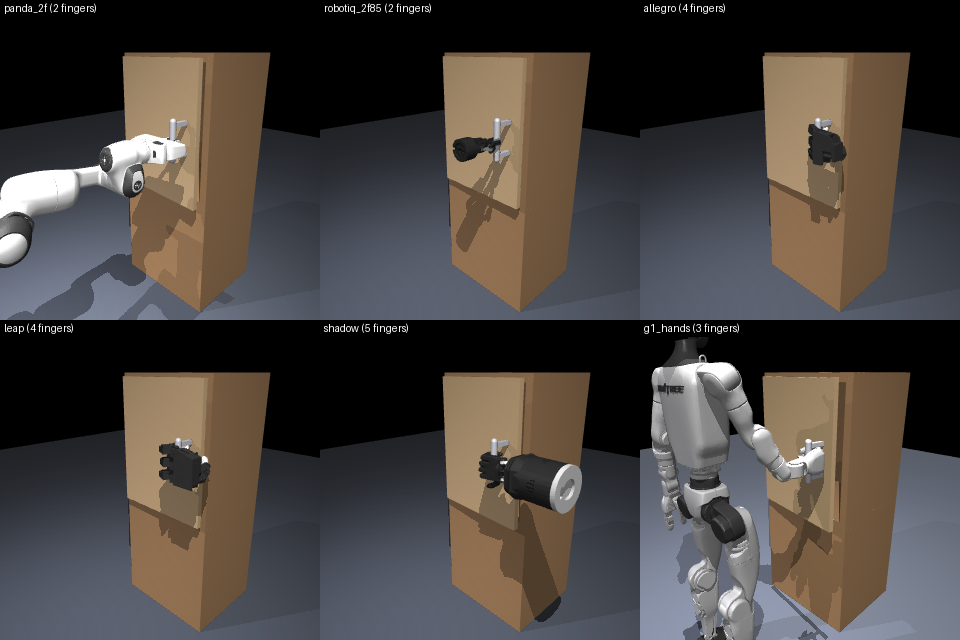

# Pixel Active Inference (PAI)

Hierarchical, pixel-based active inference for a simulated Franka Panda, building on
PixelAI (Sancaktar et al., 2020). Everything runs in simulation (MuJoCo).

**Status: sprint week 4 of 8.** Vertical slice with cause inference, adaptation and recipes; doors, drawers and six bodies; perception from pixels training on Kaggle.
The full plan is in [docs/ROADMAP.md](docs/ROADMAP.md) (main target, Stage 1 phases, Stages 2–7), the 8-week
application sprint in [docs/SPRINT.md](docs/SPRINT.md), verified literature in [docs/LITERATURE.md](docs/LITERATURE.md), and time and compute estimates in
[docs/TIME_AND_COMPUTE.md](docs/TIME_AND_COMPUTE.md).
The phase table below predates the roadmap.

| Phase | Content | State |
|---|---|---|
| 0 | MuJoCo Panda env, disturbance suite, PixelAI baseline, benchmarks, Kaggle templates | done (Kaggle notebook untested) |
| 1 | Latent world model (DINOv2 latents + action-conditioned transformer ensemble), 256px diffusion decoder, learned precision fusion, new L0 | – |
| 2 | L1 expected-free-energy planning (MPPI in latent space) with epistemic term, surprise escalation | – |
| 3 | L2 goals: image / language / abstract task goals, subgoal generation | – |
| 4 | Continual learning, online body-parameter inference, full robustness suite | – |
| 5 | Baselines (IBVS+IK, ACT, Diffusion Policy, DreamerV3/TD-MPC2, OpenVLA), evaluation, write-up | – |

## Phase 1a: tabletop scene (in progress)

`TabletopEnv` ([pai/envs/tabletop.py](pai/envs/tabletop.py), [configs/tabletop.yaml](configs/tabletop.yaml)):
Panda, table, 4 coloured blocks, a plate and a bowl; three cameras; segmentation masks per object.
- **Control:** end-effector deltas + yaw + gripper through damped least-squares IK, or joint velocities.
- **Compliant arm** (gravity compensation, 15% servo stiffness): a 40 N push deflects the hand 20 mm, 5x the stiff arm.
- **Relations** from privileged state ([pai/envs/predicates.py](pai/envs/predicates.py)): on, in, grasped, lifted, upright, near, left_of.
- **Ground-truth event log** ([pai/envs/events.py](pai/envs/events.py)): contacts, grasp/release, slips, relation
  changes and disturbances, debounced and timestamped. This is the answer key for the agent's explanations.
- **New disturbances:** object friction, and mass on any body.
- **Scripted pick-and-place** ([pai/envs/scripted.py](pai/envs/scripted.py)): 97.5% success over 80 episodes
  (4 object/target pairs x 20 layouts) with the compliant arm.

## Phase 1b: vertical slice (in progress, sprint week 1)

`on(red, plate)` end to end through every level, on privileged object state
([pai/agents/slice_agent.py](pai/agents/slice_agent.py)):

| Level | Module |
|---|---|
| L2 goals | [pai/goals/relations.py](pai/goals/relations.py): relation as ordered subgoal preferences; L2 sets the gripper mode; carrying subgoals have a maintenance condition (object held) and fall back to re-grasping |
| L1 planning | [pai/planning/mppi.py](pai/planning/mppi.py): MPPI in the learned world model, expected free energy (pragmatic + epistemic), smoothness prior, cost-relative temperature |
| World model | [pai/world/](pai/world/): transformer over entity tokens, 5-member ensemble, per-feature learned variance; wrist force predicted from state but never read |
| Surprise and causes | [pai/causes/inference.py](pai/causes/inference.py): surprise calibrated per task step; Bayesian comparison of none / push / heavier_object / slippery_object / camera_shift / unknown over 12 evidence channels (hand, wrist force, the object, the rest of the scene) |
| Adaptation | [pai/agents/slice_agent.py](pai/agents/slice_agent.py): a confident explanation changes behaviour: recalibrate the camera, expect the measured extra weight, carry a slippery object gently |
| Memory, recipes, reports | [pai/memory/](pai/memory/): episode records, recipes learned from one success ([recipes.py](pai/memory/recipes.py)), readable reports, video overlay |

### Results (sprint week 4, run v7)

100 episodes, 20 per condition: no disturbance; a 30–50 N push at a random time; a block 0.3–0.6 kg
heavier than it looks; a slippery block (5% of normal friction); the camera bumped 3–6 cm at a random
time. Surprise is calibrated on 8 separate clean episodes.

| Condition | Task success | Cause identified | Estimate vs truth |
|---|---|---|---|
| none | 100% | 100% | – |
| push | 100% | 90% | onset within 0.05 s on average |
| heavier block | 90% | 90% | extra mass within 2 g on average |
| slippery block | 75% | 60% | (7 of 20 called a push) |
| camera shift | 90% | **100%** | camera offset within 0.3 mm; the agent recalibrates itself |
| **overall** | **91%** | **88%** | |

<table>
<tr>
<td><br><sub>The camera is bumped mid-task. Everything seen jumps while the hand does not, so the agent concludes "my camera moved", estimates the offset and recalibrates.</sub></td>
<td><br><sub>A block much heavier than it looks: the wrist feels more pull than predicted while carrying. The agent names the cause and the extra mass.</sub></td>
</tr>
<tr>
<td><br><sub>A push of the arm: a short, sideways error on the hand and the wrist force.</sub></td>
<td><br><sub>A slippery block sinks in the fingers; the agent re-grasps and carries it more gently.</sub></td>
</tr>
</table>

Details: `results/slice_v7/` (tables, calibration, one report per episode, the per-step evidence
used to train the thinker). The history of runs:

| Run | Change | Conditions | Task | Cause |
|---|---|---|---|---|
| `slice_v1` | first run | 3 | 77% | 92% |
| `slice_v2` | gripper mode from L2, re-grasp fall-back | 3 | 85% | 93% |
| `slice_v4` | per-step noise calibration | 3 | 82% | 93% |
| `slice_v5` | plate contact fix, hold still while opening | 3 | 98% | 97% |
| `slice_v6` | + slippery block and camera shift, adaptation | 5 | 84% | 66% |
| `slice_v7` | per-step alarm thresholds; slipping is gravity-driven | 5 | **91%** | **88%** |

What v6 → v7 fixed, and why: (1) one alarm threshold for the whole task was set by the noisy
moment of contact and hid the quiet carry, where slips and extra weight show; thresholds are now
calibrated per task step. (2) The first slip model could explain any error on the object and the
wrist force, so pushes on a hand that held the block were called slips (11 of 20). A slip is driven
by gravity: the block sinks and the wrist loses weight, both downwards. Constrained to that, pushes
are identified again (18 of 20). The v4 → v5 fix: a slightly tilted block met the thin plate at a
single contact point and pivoted through it; a 3 mm contact margin fixed all replayed cases.

- World model on 100 held-out episodes: 1.4 mm (0.1 s), 5.9 mm (0.5 s), 21 mm (2 s) for moving
  entities, vs 14 / 39 / 65 mm for a commanded-motion baseline.
- Without wrist force sensing, cause identification was 0/4. Persistent causes (a heavier block)
  vanish from one-step prediction errors. Predicting the wrist force from the state, without
  reading it, is what makes them visible.

### Repeating a success: one-shot recipes

After ONE successful episode the agent stores a recipe: where its hand went relative to the
object and the target at each step, and what had to be true at the start. In a new layout the
recipe becomes one extra candidate for the planner, which still checks it with the world model.

| Block | Full planner (512 rollouts/step) | Small planner (4) | Small planner + recipe (4) |
|---|---|---|---|
| red (recipe learned here) | 95% | 10% | **100%** |
| blue (never seen in the recipe) | 90% | 5% | **100%** |

20 new layouts per block (`results/recipe_eval.md`). With the recipe, a planner with 128x less
compute solves the task every time, in fewer steps than the full planner. The counterfactual "why"
of the recipe is not recorded yet: open-loop replay of the whole source episode in the world model
drifts too far to be a valid baseline.

## Doors and drawers (sprint week 5 groundwork)

A fixture library ([pai/envs/fixtures.py](pai/envs/fixtures.py)) that works with any body: 22 types
in 7 families (drawers, drawer stacks, cabinet doors, room doors, sliding doors, lids, flaps), with
held-out types for testing on unseen designs, and hidden causes the agent will have to discover
(locked, stuck, blocked, latched behind a lever).



|  |  |  |
|---|---|---|
| lever first, then the latched door opens | a drawer by its knob | a locked drawer does not move |

A scripted opener (a physics check, not the agent) opened 131 of 134 unlocked or latched runs and
none of 180 locked, stuck or blocked ones.

### Many bodies, one interface

The same upper levels can drive any body through one action (palm velocity, rotation, grasp)
([pai/envs/embodiments.py](pai/envs/embodiments.py)): the Panda arm and a Robotiq gripper (2 fingers),
the Unitree G1 humanoid with its hands (3), Allegro and LEAP (4), and the Shadow hand (5, human-like).



Next: a home-door set (turning knobs with latches, thumb-turn deadbolts, key locks with real keys
that may be hidden in a drawer, push and pull doors, door closers, push bars) and an agent that
discovers how to open a locked door by itself: [docs/DISCOVERY.md](docs/DISCOVERY.md).

## Phase 0 results: PixelAI baseline

Decoder: 11.4M parameters, 60k renders, 30k steps (~45 min on an RTX 5060 laptop GPU),
validation MSE 1.9e-4. Agent gains: beta = 10, pi_mu = 40 (sweep in `results/sweep_*.json`).
Full tables: [results/pixelai_suite.md](results/pixelai_suite.md). 20 episodes per row.

| Goal distance (median start) | 5 cm | 7 cm | 11 cm | 12 cm | 23 cm |
|---|---|---|---|---|---|
| Success (within 2 cm) | 100% | 100% | 100% | 80% | 35% |

| Disturbance (11 cm goals) | none | push | occlusion | lighting | camera shift | payload | sensor noise |
|---|---|---|---|---|---|---|---|
| Success | 100% | 100% | 100% | 100% | **5%** | 100% | 95% |

What these show:
- **PixelAI is local.** The gradient of the pixel error fades once the predicted arm stops
  overlapping the goal arm, so success collapses with distance. Phase 1 moves goals and
  inference into a learned latent space.
- **A 5 cm camera shift breaks it.** The goal image comes from the original viewpoint. The
  agent drives the arm to the pose that *looks* like the goal from the new viewpoint, and
  vision and proprioception then disagree with no way to resolve it. Phase 4 targets this
  with online body and camera parameter inference.
- **The high occlusion and lighting scores flatter vision.** With pi_v = 1 on a per-pixel mean
  error, proprioception dominates state estimation, and vision mostly supplies the goal.
  A vision-only perception test (pi_q = 0) is needed to stress the visual pathway.
- **Push and payload are absorbed by the stiff position servos** (see configs/disturbances.yaml).
  A compliant control mode is needed before these measure the agent itself.

## Setup

```bash
python -m venv --system-site-packages .venv      # reuses an existing CUDA torch install
.venv/Scripts/python -m pip install -e .[dev]    # Linux/macOS: .venv/bin/python
python scripts/fetch_assets.py                   # Franka Panda from MuJoCo Menagerie (pinned commit)
python -m pytest
```

On Windows laptops with hybrid graphics, `pai.envs` loads the NVIDIA driver before the
first GL context. Otherwise OpenGL runs on the integrated GPU, about 60x slower (26 vs 1625 fps).
On headless Linux (Kaggle, Colab) set `MUJOCO_GL=egl`.

## Phase 0 workflow

```bash
python scripts/benchmark.py                                   # throughput on this machine
python scripts/collect_data.py                                # 60k (q, image) pairs -> data/pixelai
python scripts/train_decoder.py                               # PixelAI decoder, resumes automatically
python scripts/run_eval.py --no-vision agent.goal_mode=joints # privileged sanity check (no decoder)
python scripts/run_eval.py --decoder runs/pixelai_decoder/decoder.pt              # image-goal reaching
python scripts/run_eval.py --decoder runs/pixelai_decoder/decoder.pt --task perception
python scripts/run_eval.py --decoder runs/pixelai_decoder/decoder.pt --disturbance occlusion
```

Every script takes `--config` plus `key.sub=value` overrides, e.g. `train.batch_size=128`.
Disturbance presets are in [configs/disturbances.yaml](configs/disturbances.yaml): push,
occlusion, lighting, camera_shift, payload, sensor_noise.

### Kaggle (2x T4)

Use [notebooks/kaggle_train_decoder.ipynb](notebooks/kaggle_train_decoder.ipynb). It clones
the repo at a pinned commit and renders with EGL. It runs `torchrun --nproc_per_node=2` when
two GPUs are present and writes checkpoints to `/kaggle/working`. To continue a run in a new
session, attach the previous version's output and set `RESUME_FROM`.

## Layout

```
pai/envs/       MuJoCo scenes (MjSpec around Menagerie panda.xml): PandaEnv, TabletopEnv, disturbances,
                predicates, event log, scripted pick-and-place
pai/world/      entity tokens, transition data, ensemble entity world model (with force prediction)
pai/goals/      relational goals as subgoal preferences, with maintenance conditions
pai/planning/   MPPI with expected free energy
pai/causes/     calibrated surprise, Bayesian cause inference (incl. "unknown"), counterfactual credit
pai/memory/     episodic memory with trajectories, readable reports, video overlay
pai/perception/ frames + masks, DINOv2 features, object slots, slots -> entity tokens
pai/thinker/    HRM thinker prototype, synthetic cause tasks with exact Bayesian teachers, baselines
pai/models/     PixelAI decoder g(q) -> image
pai/agents/     PixelAI agent (Phase 0) and the vertical-slice agent (Phase 1b)
pai/data/       parallel data collection, memory-mapped dataset
pai/train/      resumable single/multi-GPU training (AMP: bf16 where supported, fp16 on T4)
pai/eval/       reaching / perception episodes and metrics
scripts/        CLI entry points (slice_collect, slice_train_wm, slice_eval, eval_world_model, ...)
configs/        default.yaml (Phase 0), tabletop.yaml (Phase 1), disturbances.yaml, thinker*.yaml
notebooks/      Kaggle templates (decoder training; run any script)
```

## The PixelAI agent

The full derivation is in [pai/agents/pixelai.py](pai/agents/pixelai.py). The belief over
joint angles and their velocities, (mu, mu'), follows free-energy gradients. There are three
prediction errors, each weighted by a precision: proprioception `q - mu`, vision
`s - g(mu)`, and dynamics `mu' - f(mu)`. The goal enters as an attractor f(mu) that pulls the
belief towards the goal image. Actions (joint velocities) reduce the same free energy.

Tuning notes, so nobody has to rediscover them:
- The belief dynamics have damping ratio sqrt(k_mu pi_mu / (4 beta)). With pi_mu = 1 the
  belief itself oscillates. Keep pi_mu >= 4 beta.
- The updates are explicit Euler steps, so the visual precision pi_v has a stability ceiling.
  Too large a value overshoots into a different local minimum or diverges. Adaptive step
  sizes are a Phase 1 item.
