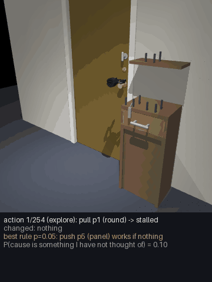

# Discovering how to open a locked door (no scripted solution)

The goal: the agent is asked to open a door. The door may be latched (turn the knob first), bolted
from the inside (a thumb-turn), or locked with a key that lies somewhere in the scene, possibly
inside a drawer. **Nothing tells the agent what a key is, what a keyhole is for, or that knobs turn.**
It has to work this out from its own attempts, the way a child does, and then reuse what it learned.

## What is given and what is learned

| Given (built in) | Learned (by the agent, from experience) |
|---|---|
| A body and a handful of motor skills that act on *any* part or object: reach, grasp, release, turn about an axis, push and pull along an axis, insert (bring a held object to a part and push along its axis) | Which skill, on which object or part, changes what |
| A world model of its own body and of rigid objects (already trained) | That turning the knob releases the door; that a thumb-turn or a key in the keyhole is what the lock depends on; which key fits which lock |
| Surprise, cause inference and curiosity (expected information gain) | Where keys tend to be (on tables, in drawers) and that containers can hide things |
| Episodic memory and recipes | A recipe "open a locked door" with its preconditions, and the *order* of the steps |

The motor skills are generic: "turn" works on a knob, a thumb-turn, a key, a jar lid. What makes
the difference between a door that opens and one that does not is **not** coded anywhere.

## The loop (design)

What the current code implements is summarised under "What is implemented" below; items 2 and 5
are only partly built.

1. **Try the obvious.** The agent grasps the handle and pulls (or pushes). Its experience with
   ordinary doors predicts the door moves. It does not.
2. **Surprise, then a hidden cause.** The prediction error is large and structured: the handle
   is grasped, force goes up, nothing moves. Cause inference compares "blocked by something
   visible", "stuck (needs more force)", and "held by something I cannot see" (locked/latched).
   A harder pull tests "stuck" cheaply.
3. **Explore on purpose.** The agent now has many possible interventions: every skill applied to
   every part it can see (knob, thumb-turn, keyhole, hinges, the bar) and every movable object
   (keys, blocks, the drawer). It keeps a belief over **causal rules** of the form
   *"doing skill S on thing X (while holding Y) makes the door openable"* and picks the next
   intervention by **expected information gain** about those rules, discounted by effort: the
   epistemic value of active inference. After each intervention it probes the door again.
   Cheap, informative things come first (turn the knob, turn the thumb-turn); composite ones
   (hold a key, insert it, turn it) become worth trying when simple ones have been ruled out, and
   because holding an object near the part that sticks out is itself informative.
4. **Search when an object is missing.** If rules involving a key look promising but no key is
   visible, "find a key" becomes a subgoal. Containers that have not been looked into carry
   information, so opening drawers scores high: search emerges from curiosity, not from a
   "search for keys" routine.
5. **Explain the success.** When the door opens, counterfactual replay (pai.causes.credit) asks
   which steps were necessary: was it the key or the knob? Did the key have to be turned? Did
   the wrong key matter? The necessary steps and their order become a **recipe** with
   preconditions (a key that fits; the bolt state), stored in memory.
6. **Reuse and transfer.** Next time: a new layout, a different lock position, the key in another
   drawer, a different body. The recipe is recalled by goal and preconditions, and the agent goes
   straight to "find key, insert, turn, turn knob, pull". Wrong keys are recognised by the
   surprise they cause (inserted but will not turn) and a different key is tried.

## What is implemented (pai/discovery)

- A belief over rules "the goal is reached by probe P on the goal part while conditions C hold"
  (up to 2 conditions), with an Occam prior, a learned action model (which action changes which
  feature), action choice by expected information gain per second of effort, planning (A*) once a
  rule is likely, a catch-all "a cause I have not thought of", and a stopping rule for no solution.
- Explanations come from contrast rules over the agent's own log (`explain.py`), not yet from
  counterfactual replay; the "stuck / blocked / hidden" cause comparison of the slice is not wired in.
- The body model is hand-written (skill durations, hand speed), not the learned world model.
- Where keys are is not learned as such: there is a generic prior that opening things reveals
  things, and recipes bias the search towards containers after a success.

- **Trials to first success** on each door type, against (a) random exploration over the same
  skills, (b) curiosity without the causal-rule belief (novelty only), (c) an oracle that knows the
  solution (the scripted solver; physics check only, never used by the agent).
- **Trials on the second encounter** (one-shot reuse), on held-out door and lock types, and with
  another embodiment (Panda, dexterous hands, the G1 humanoid).
- **Explanation accuracy:** the agent's stated reason ("the door was locked; the brass key in the
  top drawer unlocked it") against the simulator's event log (key_inserted, key_turned,
  bolt_retracted, latch_released).
- **No-solution cases:** the key is behind the locked door. The agent should conclude it cannot
  open it and say why, instead of trying forever.

## Build order

1. Home-door physics (turning knob with latch, thumb-turn deadbolt, key lock with matching keys,
   push/pull, closer, push bar), keys placed on tables, hooks or in drawers; a scripted solver
   that proves each variant is physically solvable. (In progress.)
2. Generic skills over the embodiment interface (reach, grasp, turn, push/pull, insert), usable
   by every body.
3. Causal-rule belief and information-gain exploration (the core of this document).
4. Recipes with order and preconditions; reuse and transfer experiments.
5. Explanations and the no-solution case.

## Results

Every number here is from `scripts/discovery_eval.py`. The full tables, with 95% bootstrap intervals,
are in [results/discovery_eval.md](../results/discovery_eval.md) and the raw numbers in
`results/discovery_eval.json` and `results/discovery_physics.json`. All three agents get the same
skills and the same budget of 1000 actions; a failure counts as 1000.

**MockWorld, 200 scenes per case and split** (the symbolic door; test = the 3 held-out door types).
Mean actions until the door opens, and in brackets the success rate when it is below 100%:

| case | discovery (train) | novelty (train) | random (train) | discovery (test) | novelty (test) | random (test) |
|---|---|---|---|---|---|---|
| unlocked | 1.6 | 14.2 | 10.5 | 1.6 | 22.1 | 19.4 |
| latch | 5.9 | 49.2 | 49.5 | 6.9 | 117.1 (99.5%) | 84.0 (99.5%) |
| deadbolt | 35.0 | 87.1 (99.5%) | 87.7 | 36.8 | 134.5 (99%) | 119.1 (98%) |
| key on the table | 172.1 (99.5%) | 451.3 (71%) | 569.2 (68%) | 197.1 | 486.2 (70%) | 662.8 (58%) |
| key in the drawer | 186.3 | 634.9 (51%) | 785.8 (47%) | 222.0 (99%) | 685.5 (44%) | 776.6 (45%) |
| thumb-turn + key | 205.8 | 519.8 (67%) | 605.5 (64%) | 211.0 | 558.3 (61%) | 745.6 (46%) |
| all solvable | 101.1 (99.9%) | 292.7 (81%) | 351.4 (80%) | 112.6 (99.8%) | 333.9 (79%) | 401.3 (74%) |

(Cells without a rate succeeded in every scene.)

- **Explanations.** Accuracy against the simulator's truth is 1.00 on unlocked, latched and no-solution
  doors, 0.96-0.97 on deadbolts, 0.97-0.99 on key locks and 0.92-0.93 on doors with both locks. The
  errors are mostly false deadbolt claims on key-locked doors (21 and 14 on train, 40 and 35 on test
  out of 200 each): the agent throws the thumb bolt itself while exploring, then undoes it, and it
  names that as a second lock. Counted only on the mechanisms really there, accuracy is 0.99-1.00
  on key locks and 0.92-0.95 on deadbolts and "both".
- **No solution** (the key is in the other room). The discovery agent stops and says so in 200/200
  train and 200/200 test scenes, after a mean of 322 (train) and 356 (test) actions. It gave up
  wrongly on 1 of the 1200 solvable test scenes and none of the train ones. The baselines have no
  stopping rule and run to the budget.
- **Second encounter.** A recipe from one solved train scene, then a new scene of the same lock state
  (100 pairs each, same agent seed, paired difference): key-locked doors 188 -> 122 actions on a new
  train scene and 205 -> 145 on a held-out type; both locks 214 -> 132 and 217 -> 124; deadbolt 30 -> 18
  and 37 -> 25; latch 7.1 -> 3.4 on held-out types. On train latch scenes the mean barely changes
  (6.1 -> 4.9, interval of the difference [-2.9, +1.0]) though the median halves (6 -> 3): a few
  recipes misled it. With the recipe it needed more actions in 3-20% of the pairs.

**PhysicsWorld** (MuJoCo, Robotiq gripper, 2 keys, the same agent, unchanged; 2 train types x 6 cases
x 2 seeds and the held-out hd_knob_pull_right x 6 cases x 1 seed; budget 300 actions). Opened 18 of
25 solvable doors: all 5 latched, all 5 deadbolted, 3/5 with the key on the table, 2/5 with the key in
the drawer, 3/5 with both locks. Mean 90 actions (699 s simulated) to success; explanation accuracy
1.00 on 16 of the 18 successes and 0.88 on the other two. The 5 no-solution doors all ran out the
300-action budget (in the mock, giving up takes a mean of 322-356 actions). The 30 episodes took
711 min of simulated time and 348 s of wall time on 10 processes. The failures come from the body:
keys dropped or not lifted, inserts that miss, and a key pulled while turned, which the agent then
has to learn around, not from wrong reasoning about the lock.

The agent on hd_knob_pull_left (key in the drawer, seed 1, 254 actions, success): each frame shows
the action, what changed, its most probable rule and the mass it still gives to a cause it has not
thought of; the last frame is its explanation.

Fixes made while integrating (pai/discovery/belief.py, all neutral on the mock: key 187.9 / 201.9 and
both 225.6 / 228.3 mean actions on 60 train / test scenes, against 186.7 / 199.7 and 226.8 / 228.4
before): a pick known to change nothing no longer counts as enabling the object skills; pulling a held
key back out of a part pays the same restore charge as any other state change (it looped insert /
withdraw in physics, where that pick is offered); and a skill that fails to run 3 times in a row in
the same context is recorded as having no effect there (it retried an impossible insert forever).

## Limits of this evaluation (from an independent review)

- **Built-in locality.** Probes are limited to parts within 0.7 m of the door, and conditions far
  from the door are penalised; explanations also keep only conditions near the door. The mock
  adds decoy parts on the door leaf (a dial in 50% of scenes, a hook in 30%), but the physics
  scene has **no decoys**: there, every part on the door is a mechanism. Next: decoys in physics
  and an ablation without the locality prior.
- **Shapes.** In the mock each part shape belongs to one mechanism (the lock cylinder is the only
  non-graspable disc, the thumb-turn the only "wing"). Recipes use shape with weight 0.2, so part
  of the reuse gain may be shape matching. Next: shared shapes between decoys and mechanisms.
- **Rule size** max 2 conditions is exactly what the hardest case needs.
- **Held-out door types** differ in swing, handle and knob direction; the lock mechanisms are the
  same. Held-out *mechanisms* are not tested.
- **Parameters** (radius, proximity, reveal and novelty weights, recipe bonuses) were set during
  development; the integration fixes were checked on 60 train and 60 test scenes that are the
  first 60 of the reported 200. A clean re-run on fresh seeds is needed before quoting numbers.
- **Not yet measured:** transfer to other bodies (Panda, dexterous hands, G1), and the claim that
  physics failures are the body's (the log records actions, not failure causes). The physics run
  used a 600 s wall limit per episode.

## Related work to position against

Interventional causal discovery and active learning of causal structure; curiosity and
information gain in active inference; object-centric world models with sparse interaction rules
(AXIOM); learned symbolic operators from interaction (VisualPredicator); and "tool use" and
lock-box puzzles from developmental psychology and animal cognition (e.g. the mechanical
puzzle-box tradition). These have to be cited carefully in the paper; see docs/LITERATURE.md.
