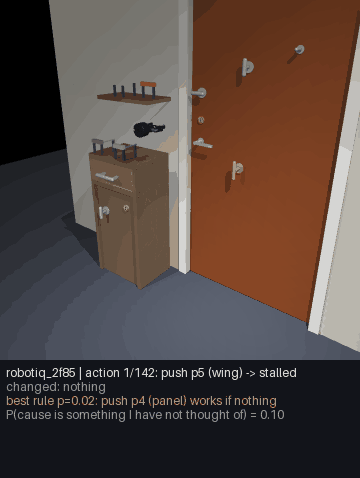
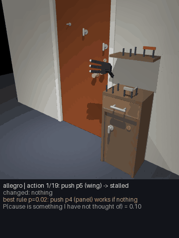

# Discovering how to open a locked door (no scripted solution)

The goal: the agent is asked to open a door. The door may be latched (turn the knob first), bolted
from the inside (a thumb-turn), or locked with a key that lies somewhere in the scene, possibly
inside a drawer. **Nothing tells the agent what a key is, what a keyhole is for, or that knobs turn.**
It has to work this out from its own attempts, the way a child does, and then reuse what it learned.

## What is given and what is learned

| Given (built in) | Learned (by the agent, from experience) |
|---|---|
| A body and a handful of motor skills that act on *any* part or object: reach, grasp, release, turn about an axis, push and pull along an axis, insert (bring a held object to a part and push along its axis) | Which skill, on which object or part, changes what |
| A world model of its own body and of rigid objects (already trained) | That turning the knob releases the door; that a thumb-turn or a key in the keyhole is what the lock depends on; which key fits which lock |
| Surprise, cause inference and curiosity (expected information gain) | Where keys tend to be (on tables, in drawers) and that containers can hide things |
| Episodic memory and recipes | A recipe "open a locked door" with its preconditions, and the *order* of the steps |

The motor skills are generic: "turn" works on a knob, a thumb-turn, a key, a jar lid. What makes
the difference between a door that opens and one that does not is **not** coded anywhere.

## The loop (design)

What the current code implements is summarised under "What is implemented" below; items 2 and 5
are only partly built.


1. **Try the obvious.** The agent grasps the handle and pulls (or pushes). Its experience with
   ordinary doors predicts the door moves. It does not.
2. **Surprise, then a hidden cause.** The prediction error is large and structured: the handle
   is grasped, force goes up, nothing moves. Cause inference compares "blocked by something
   visible", "stuck (needs more force)", and "held by something I cannot see" (locked/latched).
   A harder pull tests "stuck" cheaply.
3. **Explore on purpose.** The agent now has many possible interventions: every skill applied to
   every part it can see (knob, thumb-turn, keyhole, hinges, the bar) and every movable object
   (keys, blocks, the drawer). It keeps a belief over **causal rules** of the form
   *"doing skill S on thing X (while holding Y) makes the door openable"* and picks the next
   intervention by **expected information gain** about those rules, discounted by effort: the
   epistemic value of active inference. After each intervention it probes the door again.
   Cheap, informative things come first (turn the knob, turn the thumb-turn); composite ones
   (hold a key, insert it, turn it) become worth trying when simple ones have been ruled out, and
   because holding an object near the part that sticks out is itself informative.
4. **Search when an object is missing.** If rules involving a key look promising but no key is
   visible, "find a key" becomes a subgoal. Containers that have not been looked into carry
   information, so opening drawers scores high: search emerges from curiosity, not from a
   "search for keys" routine.
5. **Explain the success.** When the door opens, counterfactual replay (pai.causes.credit) asks
   which steps were necessary: was it the key or the knob? Did the key have to be turned? Did
   the wrong key matter? The necessary steps and their order become a **recipe** with
   preconditions (a key that fits; the bolt state), stored in memory.
6. **Reuse and transfer.** Next time: a new layout, a different lock position, the key in another
   drawer, a different body. The recipe is recalled by goal and preconditions, and the agent goes
   straight to "find key, insert, turn, turn knob, pull". Wrong keys are recognised by the
   surprise they cause (inserted but will not turn) and a different key is tried.

## What is implemented (pai/discovery)

- A belief over rules "the goal is reached by probe P on the goal part while conditions C hold"
  (up to 2 conditions), with an Occam prior, a learned action model (which action changes which
  feature), action choice by expected information gain per second of effort, planning (A*) once a
  rule is likely, a catch-all "a cause I have not thought of", and a stopping rule for no solution.
- Explanations come from contrast rules over the agent's own log (`explain.py`), not yet from
  counterfactual replay; the "stuck / blocked / hidden" cause comparison of the slice is not wired in.
- The body model is hand-written (skill durations, hand speed), not the learned world model.
- Where keys are is not learned as such: there is a generic prior that opening things reveals
  things, and recipes bias the search towards containers after a success.
- **Locality is a switch.** `agent.Locality(radius=0.7, probe_prior=1.0, lit_prior=1.0, explain="near")`
  holds the built-in locality assumptions: probes only on parts within 0.7 m of the door, a distance
  penalty in the prior over probes and over conditions, and explanations that keep only conditions near
  the door. `Locality.off()` removes all four: probes on any part in view, no distance penalties, and
  the evidence-based explanation filter (`explain.py`: a condition is kept only if the same probe failed
  without it and either the contrast is clean or the belief puts more than half its mass on it).
- **Decoys.** MockWorld with `shared_shapes=True` adds decoys shaped like the mechanisms: a
  non-graspable disc on the cabinet like the lock cylinder, a wing on the leaf that turns and stays
  turned like the thumb-turn, and a door dial shaped like the handle. The MuJoCo scene has physical
  decoys (`home_doors.DECOYS`, `decoys=True`): a dial on the leaf shaped like the handle, a thumb-turn
  copy on the leaf, a coat hook, a disc with a keyhole and a wing on the cabinet front, and a free peg
  about a key's length on the shelf. None of them is connected to anything, and nothing in their ids
  or attributes tells them apart from mechanisms.
- **Other bodies.** `bodies.py` runs the same PhysicsWorld with any embodiment and records the
  ground truth after every action (`TracedWorld`), so a door that stayed shut can be put down to the
  body (skills that did not execute or stalled) or to the agent (`failure_cause`).

## How it is evaluated

- **Trials to first success** on each door type, against (a) random exploration over the same
  skills, (b) curiosity without the causal-rule belief (novelty only), (c) an oracle that knows the
  solution (the scripted solver; physics check only, never used by the agent).
- **Trials on the second encounter** (one-shot reuse), on held-out door types, and with other
  embodiments (Panda, dexterous hands, the G1 humanoid).
- **Explanation accuracy:** the agent's stated reason ("the door was locked; the brass key in the
  top drawer unlocked it") against the simulator's event log (key_inserted, key_turned,
  bolt_retracted, latch_released).
- **No-solution cases:** the key is behind the locked door. The agent should conclude it cannot
  open it and say why, instead of trying forever.
- **Ablations:** locality off, decoys shaped like the mechanisms, and both together.

## Build order

1. Home-door physics (turning knob with latch, thumb-turn deadbolt, key lock with matching keys,
   push/pull, closer, push bar), keys placed on tables, hooks or in drawers; a scripted solver
   that proves each variant is physically solvable. (In progress.)
2. Generic skills over the embodiment interface (reach, grasp, turn, push/pull, insert), usable
   by every body.
3. Causal-rule belief and information-gain exploration (the core of this document).
4. Recipes with order and preconditions; reuse and transfer experiments.
5. Explanations and the no-solution case.

## Results

These are the results of a clean re-run on fresh seeds. The agent's parameters were frozen before
it, and every scene seed and agent seed is offset by 100000 from the development seeds. Full tables
with 95% bootstrap intervals (2000 resamples) are in
[results/discovery_v2/eval.md](../results/discovery_v2/eval.md) and the raw numbers in
`results/discovery_v2/*.json`. The other-bodies run is in
[results/discovery_bodies/report.md](../results/discovery_bodies/report.md). In the mock all agents
get the same skills and a budget of 1000 actions, and a failure counts as 1000.

```
.venv/Scripts/python scripts/discovery_eval.py mock --seed-offset 100000 --out results/discovery_v2 --processes 8 --config default
.venv/Scripts/python scripts/discovery_eval.py mock ... --config shared --reuse 0
.venv/Scripts/python scripts/discovery_eval.py mock ... --config loc_off --agents discovery --reuse 0
.venv/Scripts/python scripts/discovery_eval.py mock ... --config both_off --agents discovery
.venv/Scripts/python scripts/discovery_eval.py physics --seed-offset 100000 --decoys --config default|loc_off --budget 300 --limit 3000 --out results/discovery_v2
.venv/Scripts/python scripts/discovery_eval.py report2 --out results/discovery_v2
.venv/Scripts/python scripts/discovery_bodies_eval.py oracle | agent --seeds 2 --processes 6 | report
```

**MockWorld, 200 scenes per case and split, default agent** (test = the 3 held-out door types).
Mean actions until the door opens, and in brackets the success rate when it is below 100%:

| case | discovery (train) | novelty (train) | random (train) | discovery (test) | novelty (test) | random (test) |
|---|---|---|---|---|---|---|
| unlocked | 1.6 | 24.6 | 5.6 | 1.6 | 24.3 | 8.7 |
| latch | 5.9 | 45.9 | 38.1 | 7.0 | 109.6 (99.5%) | 87.1 (99.5%) |
| deadbolt | 31.2 | 95.9 | 75.9 | 35.4 | 135.7 (99.5%) | 96.8 (99.5%) |
| key on the table | 165.0 | 531.1 (63%) | 545.1 (69.5%) | 209.4 (99.5%) | 559.3 (64.5%) | 675.8 (60%) |
| key in the drawer | 186.1 (99.5%) | 597.5 (51.5%) | 726.4 (52%) | 202.2 | 635.3 (52.5%) | 784.2 (48.5%) |
| thumb-turn + key | 208.1 | 577.8 (62.5%) | 680.6 (61.5%) | 214.2 | 529.7 (69.5%) | 688.7 (57%) |
| all solvable | 99.7 (99.9%) | 312.1 (79.5%) | 345.3 (80.5%) | 111.6 (99.9%) | 332.3 (80.9%) | 390.2 (77.4%) |

(Cells without a rate succeeded in every scene.) The 95% interval of the discovery agent over all
solvable scenes is [93.6, 105.8] on train and [105.1, 117.8] on test.

- **Explanations.** Accuracy against the simulator's truth is 1.00 on unlocked and latched doors,
  0.959 / 0.974 (train / test) on deadbolts, 0.993 / 0.975 with the key on the table, 0.985 / 0.978
  with the key in the drawer, 0.929 / 0.927 with both locks, and 1.000 / 0.999 on no-solution doors.
  All false claims are on key-locked doors: 10 and 35 (key on the table, train and test) and 18 and
  36 (key in the drawer) over 200 scenes each.
- **No solution** (the key is in the other room). The discovery agent stops and says so in 200/200
  train and 199/200 test scenes, after a mean of 330.6 (train) and 366.2 (test) actions. It gave up
  wrongly on 1 of the 1200 solvable train scenes and none of the test ones. The baselines have no
  stopping rule and run to the budget.
- **Second encounter.** A recipe from one solved train scene, then a new scene of the same lock state
  (100 pairs each, same agent seed, paired difference). Mean actions without and with the recipe, on
  a new train scene and on a held-out type:

  | lock | train scene | held-out type | paired difference (held-out) | more actions with the recipe (held-out) |
  |---|---|---|---|---|
  | latch | 5.5 -> 4.7 | 7.5 -> 2.9 | -4.7 [-6.0, -3.3] | 3% |
  | deadbolt | 29.6 -> 19.0 | 36.3 -> 24.1 | -12.2 [-15.5, -8.8] | 8% |
  | key | 173.4 -> 113.9 | 210.2 -> 150.8 | -59.4 [-87.7, -26.0] | 17% |
  | both | 207.0 -> 136.8 | 214.7 -> 127.8 | -87.0 [-110.3, -68.4] | 9% |

  On train latch scenes the mean barely changes (paired difference -0.9 [-2.1, 0.4]) though the
  median halves (6 -> 3): some recipes mislead it, and it needed more actions in 18% of those pairs.

**Ablations (MockWorld, discovery agent, same scenes).** `loc_off` is `Locality.off()`; `shared` is
MockWorld with decoys shaped like the mechanisms; `both_off` is both. Mean actions on the held-out
test types (success rate when below 100%):

| case | default | loc_off | shared | both_off |
|---|---|---|---|---|
| unlocked | 1.6 | 3.2 | 1.6 | 11.1 |
| latch | 7.0 | 37.0 | 9.4 | 23.2 |
| deadbolt | 35.4 | 66.8 (99%) | 83.2 (98.5%) | 150.5 (98.5%) |
| key on the table | 209.4 (99.5%) | 286.6 (99%) | 287.1 (99%) | 415.4 (94.5%) |
| key in the drawer | 202.2 | 278.9 (97.5%) | 280.3 | 389.6 (96.5%) |
| thumb-turn + key | 214.2 | 280.6 (97.5%) | 282.9 (99.5%) | 373.5 (98.5%) |
| all solvable (test) | 111.6 (99.9%) | 158.8 (98.8%) | 157.4 (99.5%) | 227.2 (98.0%) |
| all solvable (train) | 99.7 (99.9%) | 144.7 (98.9%) | 144.9 (99.8%) | 202.4 (99.0%) |
| wrongly gave up (train / test, of 1200) | 1 / 0 | 7 / 7 | 1 / 1 | 0 / 1 |
| no solution: gave up (train / test, of 200) | 200 / 199 | 200 / 200 | 200 / 200 | 125 / 107 |

- **Solving does not depend on the locality prior, but it costs.** With locality off, or with decoys
  shaped like the mechanisms, the agent needs 41-45% more actions over all solvable scenes. With both,
  it needs about twice as many (202.4 train, 227.2 test). That is still fewer than the default-config
  novelty baseline (312.1, 332.3). With decoys shaped like the mechanisms, the baselines also get
  worse (all solvable: novelty 339.8 / 386.9, random 408.2 / 419.4, train / test), and the discovery
  agent keeps its lead.
- **Explanations get worse under every ablation.** On held-out deadbolts, accuracy is 0.974 under
  default, 0.886 with locality off, 0.884 with shared shapes and 0.909 with both. False claims on
  held-out latched doors go from 0 to 35 with locality off.
- **Giving up needs a larger budget under both_off**: the no-solution stop fired within 1000 actions
  in only 125 of 200 train and 107 of 200 test scenes.
- **Recipes help more when the prior helps less.** Under both_off the paired saving on held-out types
  is -14.0 [-19.1, -8.2] actions for latch, -93.9 [-123.7, -70.9] for deadbolt (142.8 -> 48.9),
  -158.1 [-198.2, -120.4] for the key and -153.7 [-185.3, -123.2] for both locks.

**PhysicsWorld with physical decoys** (MuJoCo, Robotiq gripper, 2 keys, decoys on, the same agent
unchanged; 2 train types x 6 cases x 2 seeds and the held-out hd_knob_pull_right x 6 cases x 1 seed;
budget 300 actions and 3000 s wall per episode):

| config | latch | deadbolt | key on the table | key in the drawer | both | opened (solvable) | no solution: gave up |
|---|---|---|---|---|---|---|---|
| default | 5/5 | 5/5 | 1/5 | 0/5 | 1/5 | 12/25 | 0/5 |
| locality off | 5/5 | 2/5 | 0/5 | 0/5 | 1/5 | 8/25 | 0/5 |

- Under default the successes took a mean of 70.7 actions (629 s simulated), and the explanation
  accuracy over successes is 0.93.
- **The deadbolt 5/5 is not a discovery of the bolt** (independent review): each deadbolt episode
  has exactly the same action sequence as the latch-only episode with the same type and seed. An
  exploratory `turn_push` of the thumb piece retracted the bolt by chance (replayed:
  hd_knob_pull_left, seed 100000, action 18), the door then opened on the handle, and every
  deadbolt explanation says only "latched" (accuracy 0.857, the bolt missed). With locality off
  the episodes differ and 2/5 open.
- 3 of the 15 key-locked physics episodes are on hd_knob_pull_right, where the scripted oracle
  also fails to turn the key with this gripper: they may be physically unreachable.
- pai/discovery/physics.py changed after these runs (recorded code hash 30b85911b1f7); one
  replay under the current file reproduced the recorded episode exactly, but no wider check was
  made, and results/discovery_bodies records no code hashes.
- **Decoys take about half the actions:** 3213 of 6248 under default and 2972 of 7328 with locality
  off (`decoy_actions_*.json`).
- **The key cases are budget-limited.** Every default episode that failed stopped at the 300-action
  budget, and no no-solution door was given up within it.
- No episode went unstable or hit the wall limit. The longest took 1354 s wall. The two runs took
  3748 s (5 processes) and 1550 s (8 processes). These are 30 episodes per config, so the physics
  rows are indicative.



The agent with the Robotiq gripper and decoys on (hd_lever_pull_right, deadbolt, seed 200000, 142
actions, success). Each frame shows the action, what changed, its most probable rule and the mass it
still gives to a cause it has not thought of; the last frame is its explanation: "The door was
latched: it opens when I keep turning the bar part p10 while pulling. It was also bolted: it only
moved after I turned the wing part p3."

**Other bodies** (PhysicsWorld with decoys on, 2 keys, the same agent unchanged; types
hd_knob_pull_left and hd_lever_pull_right, seeds 200000 and 200001, 24 episodes per body; budget 300
actions or 600 s wall per episode). Here "unlocked" has no working latch and "latch" is the spring
latch only. The oracle is the scripted solver on the same scenes.

| body | unlocked | latch | deadbolt | key on the table | key in the drawer | opened (of 20) | oracle (of 20) | actions whose skill did not execute |
|---|---|---|---|---|---|---|---|---|
| Robotiq 2F-85 (reference) | 4/4 | 4/4 | 2/4 | 0/4 | 0/4 | 10 | 15 | 2% of 3714 |
| Panda | 0/4 | 0/4 | 0/4 | 0/4 | 0/4 | 0 | 3 | 100% of 4974 |
| Allegro | 4/4 | 2/4 | 2/4 | 0/4 | 0/4 | 8 | 3 | 55% of 4869 |
| LEAP | 3/4 | 2/4 | 1/4 | 0/4 | 0/4 | 6 | 2 | 20% of 3130 |
| Shadow | 4/4 | 0/4 | 0/4 | 0/4 | 0/4 | 4 | 5 | 94% of 4990 |
| G1 (Dex3 hand) | 0/4 | 0/4 | 0/4 | 0/4 | 0/4 | 0 | 0 | 74% of 1305 |

No body gave up on a no-solution door (0/4 each).

Why solvable doors stayed shut (`bodies.failure_cause`, from the ground-truth trace):

| body | not executed | stalled | reasoning | timeout |
|---|---|---|---|---|
| Robotiq 2F-85 | 0 | 0 | 3 | 7 |
| Panda | 20 | 0 | 0 | 0 |
| Allegro | 7 | 3 | 1 | 1 |
| LEAP | 11 | 1 | 1 | 1 |
| Shadow | 14 | 0 | 2 | 0 |
| G1 | 10 | 1 | 0 | 9 |

- **On the hands, most failures are the body's.** Their skills do not execute (mostly failed grasps).
  With the Robotiq gripper, 7 of the 10 failures were the 600 s wall limit running out at the key
  insert. All 24 G1 episodes hit that limit.
- **It is also an agent problem.** A skill that does not execute gives the agent no evidence, so the
  part it rates most informative stays on top. Panda spent all 4974 of its actions on failed grasps of
  the fixed door hook, up to 300 in a row. Shadow's grasp of the handle failed 2999 of 3006 times.
- **The oracle is no upper bound for hands.** The agent opened more doors than the scripted oracle
  with Allegro (8 against 3) and LEAP (6 against 2): it also opens doors through decoys and leaf
  parts (Shadow opened unlocked doors by pulling the wing decoy on the leaf), while the oracle always
  uses the handle.



The same agent with the Allegro hand (hd_knob_pull_left, latch, seed 200000, 19 actions, success):
"The door was latched: it opens when I keep turning the round part p10 while pulling." More clips:
`media/discovery/leap_deadbolt.gif`, `media/discovery/shadow_unlocked.gif`. Panda and G1 opened no
door, so they have no clip.

**First run (parameters set on overlapping seeds).** The first evaluation
([results/discovery_eval.md](../results/discovery_eval.md), `results/discovery_physics.json`) used
seeds 0-199. The parameters were set during development, the integration fixes to `belief.py` were
checked on the first 60 of those seeds, and the physics scene had no decoys. Over all solvable mock scenes it gave 101.1
(train) and 112.6 (test) actions, and every per-case interval of the clean re-run overlaps its
interval. In physics without decoys it opened 18 of 25 solvable doors (latched doors in 6.0 actions),
against 12 of 25 with decoys. Its clip is `media/discovery/key_in_drawer.gif`.

## Limits of this evaluation (from an independent review)

Addressed since the review: the numbers above come from fresh seeds with frozen parameters; the
physics scene has decoys; locality can be switched off and has been ablated; the mock has decoys
shaped like the mechanisms; other bodies have been measured, with failure causes from a ground-truth
trace. What is still open:

- **Locality is still the default, and it helps.** Removing it costs 41-45% more actions in the mock,
  and 12/25 -> 8/25 opened in physics. The baselines keep their 0.7 m probe radius in every config.
  The recipe role feature "near" (`recipes.NEAR` = 0.7 m, weight 0.3) is a locality cue learned from
  the first scene, and it has no switch.
- **Mock and physics decoys differ.** Mock hooks have the shape "peg", which physics never produces,
  and the mock has no cabinet wing. The mock pen is 0.14-0.16 long, while physics keys are about
  0.10-0.12, so its length gives it away. The mock's push-bar dial copies the bar's size. Decoy
  positions do not match.
- **Rule size** max 2 conditions is exactly what the hardest case needs.
- **Held-out door types** differ in swing, handle and knob direction; the lock mechanisms are the
  same. Held-out *mechanisms* are not tested.
- **Mixed code versions.** Other work changed `agent.py` between the v2 runs; each file records the
  code hash. A replay check found the shared-config means for unlocked, latch and deadbolt identical,
  and 41 of 42 both_off episodes identical (one went from 993 to 1000 actions). The default and
  loc_off mock runs were not cross-checked. In the bodies run, 3 short episodes replayed identically
  under the latest code; no long episode was replayed.
- **Physics is small and budget-bound.** There are 30 episodes per config and 24 per body. The key
  cases mostly stop at the 300-action budget, and about half of all actions go to decoys. No physics
  no-solution door was given up within 300 actions, against 199-200 of 200 in the mock at 1000. The
  bodies run used a 600 s wall limit, which ended 7 of the 10 Robotiq failures and every G1 episode.
  The v2 physics run used 3000 s.
- **Failed skills give no evidence**, so with bodies that cannot grasp a part the agent keeps
  choosing it (Panda: up to 300 failed grasps in a row). This needs an agent change, for example a
  cost for a skill that does not execute.
- **Thumb bolt under pull and push.** The bodies traces show the thumb bolt retracting under pull (20)
  and push (27) actions. Whether that matches the intended thumb-turn mechanics is not checked.

## Related work to position against

Interventional causal discovery and active learning of causal structure; curiosity and
information gain in active inference; object-centric world models with sparse interaction rules
(AXIOM); learned symbolic operators from interaction (VisualPredicator); and "tool use" and
lock-box puzzles from developmental psychology and animal cognition (e.g. the mechanical
puzzle-box tradition). These have to be cited carefully in the paper; see docs/LITERATURE.md.
